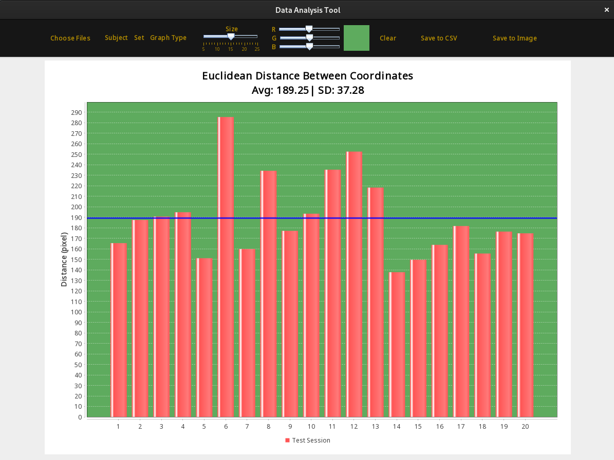
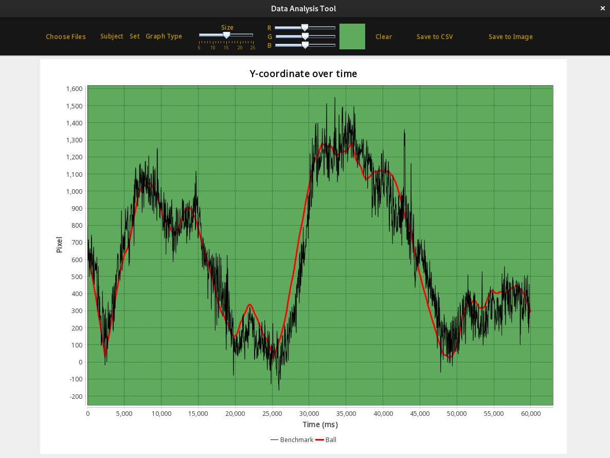

#  Data Analysis Tool for the Benchmarking Extension 

##  About the tool: 

This is a complementary tool to analyze data gathered from the benchmarking extension.

The benchmarking extension is designed to assess the accuracy of Eye-Tracking software.    
It is an extension of the existing "EyesOnTheCode" program with benchmarking functionality,    
created by two students who aimed to provide a valuable service to Eye-Tracking software participants.

## Usage: 

The program can either be run as a .jar or in an IDE environment. The program
allows the user to import the JSON files produced by the benchmarking extension, 
which then automatically extracts the data from the files. In the current version, 
the software can produce two main types of graphs.

###  Bar Chart 

The bar chart summarizes all of the tests
loaded into the program. It calculates the average Euclidean
distance for the individual test sessions and is displayed on
the y-axis. The x-axis displays the tests in chronological
order from first to last. The chart also displays a blue line
indicating the average for all test sessions. Finally, the average
value (blue line) and the standard deviation are displayed
underneath the header with a precision of two decimal points.

###  Line Chart 

The line chart displays individual test
sessions and has three different charts available. The program
can display a chronological line chart of the x and y-axis
movements of the object and the gaze points over time, where
the object is presented in red and the gaze in black. This
allows researchers to see how the test progressed over time
visually. It is also possible to display the average Euclidean
distance over time in black, with a moving average displayed
in red. This chart also includes the average distance for the
whole session and the standard deviation for the individual
tests.

## License: 

The source code is published on GitHub, under the GNU General Public License,    
and is accessible for free. We appreciate any feedback or suggestions you may have.   